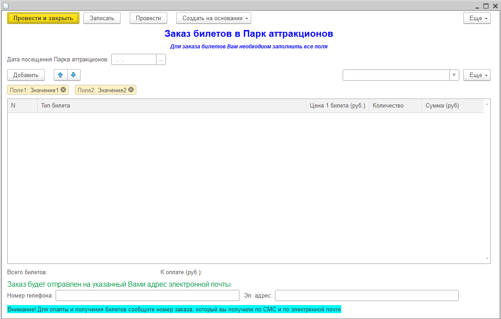
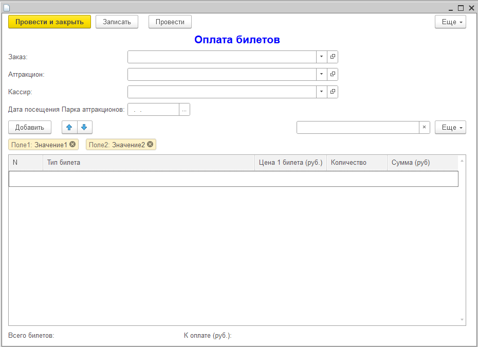

# Экзамен
При сдаче экзамена была поставлена задача, создать конфигурацию для парка аттракционов. Созданы все необходимые объекты конфигурации, а также формы к ним. Занесена основная информация об парке аттракционов. 
___
Далее, будут перечислены объекты конфигурации. Формы созданные самостоятельно видны на скриноштах. Код из модулей форм приведен рядом.
## Объекты конфигурации
+ Справочники
  1. Должности 
  2. Сотрудники
  3. ЦенаБилетов
  4. ЗоныПарка
  5. Аттракционы
+ Документы
  1. [Заказы](#заказы)
  2. [Оплата](#оплата)
+ Перечисления
  1. Подразделение
+ Отчеты
  1. ОтчетБилеты
+ Регистры накоплений
  1. ПродажиБилетов

### Заказы
Форма\
\
Код
```
&НаСервере
Функция БилетыТипБилетаПриИзмененииНаСервере(ТипБилета)
	Билет = Справочники.ЦеныБилетов.НайтиПоНаименованию(ТипБилета);
	Возврат Билет.Цена;
КонецФункции

&НаКлиенте
Процедура БилетыТипБилетаПриИзменении(Элемент)
	СтрТабЧасти = Элементы.Билеты.ТекущиеДанные;
	СтрТабЧасти.Цена = БилетыТипБилетаПриИзмененииНаСервере(СтрТабЧасти.ТипБилета);
КонецПроцедуры

&НаКлиенте
Процедура БилетыКоличествоПриИзменении(Элемент)
	СтрТабЧасти = Элементы.Билеты.ТекущиеДанные;
	СтрТабЧасти.Сумма = СтрТабЧасти.Цена * СтрТабЧасти.Количество;
КонецПроцедуры
```
### Оплата
Форма\

